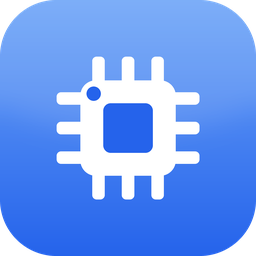
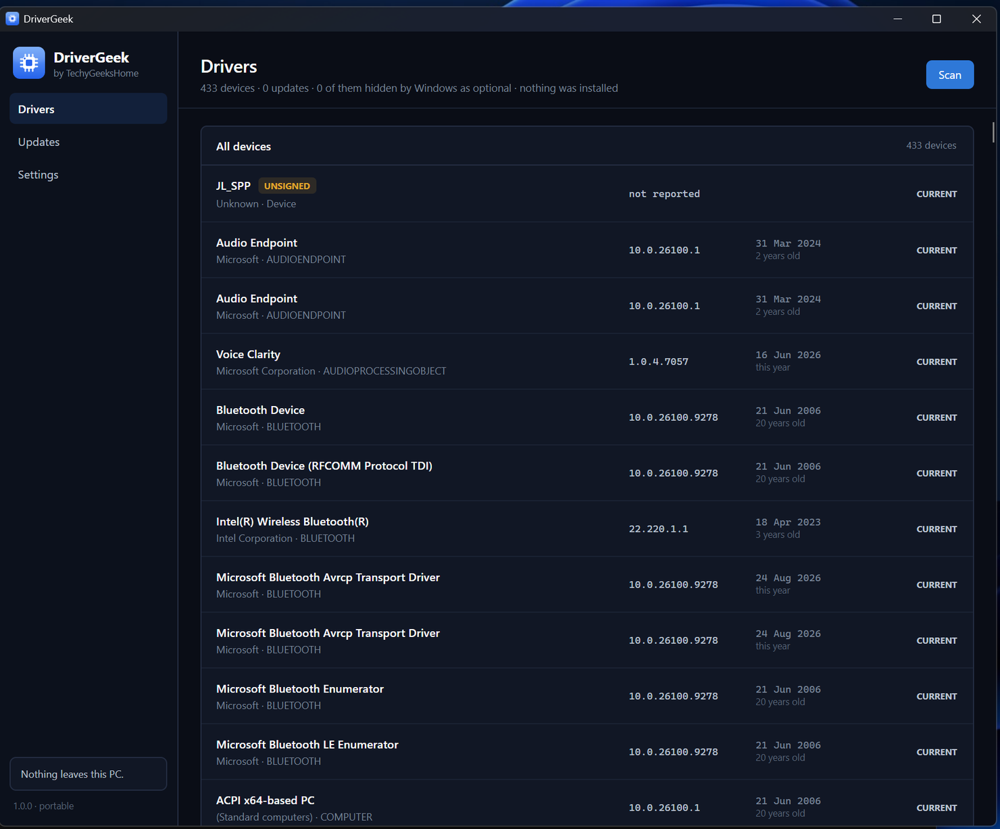
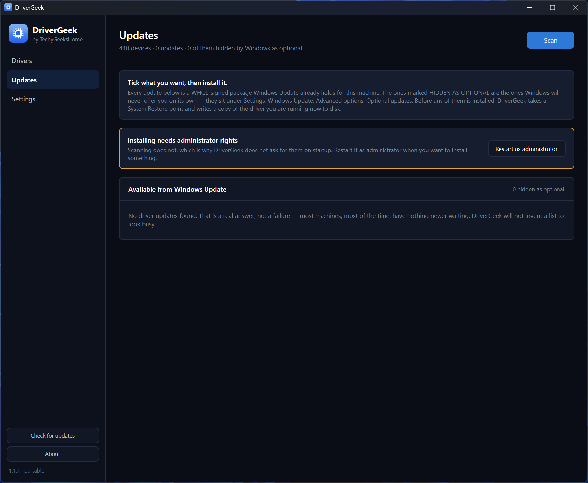
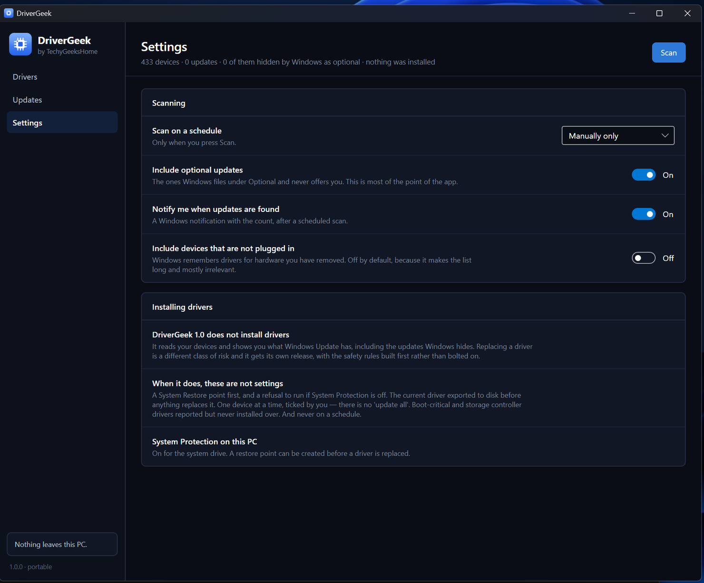

<div align="center">



# DriverGeek

**See every driver on your PC — and the updates Windows Update keeps hidden.**

[](https://github.com/techygeekshome/DriverGeek)
[](#getting-it-running)
[](LICENSE)
[](https://techygeekshome.info)
[](https://ko-fi.com/techygeekshome)

[What it does](#what-it-does) · [Screenshots](#screenshots) · [What it refuses to do](#what-it-refuses-to-do) · [Getting it running](#getting-it-running) · [Build from source](#build-from-source) · [Licence](#licence)

</div>

---

Windows already knows about driver updates you have never been offered. They sit under
Settings → Windows Update → Advanced options → **Optional updates**, four clicks deep, and
almost nobody looks there. DriverGeek lists every device on the machine with the driver it is
actually running — version, date, provider, whether it is signed — and puts the updates Windows
is already holding for you on the same screen.

For everything else, it tells you what you have and links to the manufacturer's own support
page. It does not host drivers, it does not scrape vendor sites, and it does not ship a driver
pack.

## What it refuses to do

This category has a reputation, and it was earned. So, plainly:

- **No driver pack, no third-party driver hosting.** Updates come from Windows Update, which is
WHQL-signed and already trusted by your machine. Anything else is a link to the vendor.
- **No "247 issues found!"** An old driver that works is not a problem. DriverGeek distinguishes
*there is a newer driver available from Windows Update* from *this driver is old*, and it will
tell you when the answer is that nothing needs doing.
- **No scan-then-pay.** There is no paid tier, no upsell and nothing withheld.
- **No telemetry, no account, no bundled offers.**
- **It never installs anything on its own.** No automatic mode, no scheduled installs.

## What it does

- 🔎 **Full driver inventory** — every device, its current driver version and date, the provider,
and whether the driver is signed.
- ⬇️ **Surfaces optional driver updates** — the ones Windows Update has but does not offer you.
- 🏷️ **Honest staleness** — flags drivers with a newer version available, not merely old ones.
- 🔗 **Vendor links** — for hardware Windows Update does not cover, a direct link to the
manufacturer's support page for that device.
- 📖 **1.0 reads and reports. It does not install.** Everything above is a read of your machine
and a question put to Windows Update. Nothing is downloaded and nothing is changed.
- 🚩 **Marks what an install would refuse** — boot-critical and storage controller drivers are
labelled on the list, because when the install path lands they will never be replaced.

### Where 1.0 stops

Shipping the reading half first is deliberate: it is most of the value with none of the risk.
When installing arrives it exports the current driver to disk first, refuses to run at all if
System Protection is off, takes a restore point, and does one device at a time — ticked by you.
There is no "update all", and there never will be one on a schedule.

## Screenshots

<div align="center">

**Drivers** — every device, its driver version and date, and whether it is signed.



**Updates** — what Windows Update is holding, including the ones it hides under Optional.



**Settings** — scanning options, and a plain statement of what 1.0 will not do.



</div>

## Getting it running

DriverGeek has not had a public release yet, so there is nothing to download at the moment. When
there is, this section will carry the installer and the portable build, both with published
SHA-256 hashes.

## Build from source

Requires the [.NET 8 SDK](https://dotnet.microsoft.com/download/dotnet/8.0).

```powershell
dotnet build src/DriverGeek/DriverGeek.csproj -c Release
```

```powershell
dotnet publish src/DriverGeek/DriverGeek.csproj -c Release -r win-x64 --self-contained true
```

## Support & contributing

Found a bug or have a request? [Open an issue](https://github.com/techygeekshome/DriverGeek/issues)
or [get in touch](https://techygeekshome.info/contact/). Contributions are welcome — see
[CONTRIBUTING.md](CONTRIBUTING.md).

## ☕ Support

If DriverGeek saves you an afternoon, [buy us a coffee](https://ko-fi.com/techygeekshome). It is
never required and nothing is withheld without it.

## Licence

DriverGeek is free software under the **GNU General Public License v3.0** — see [LICENSE](LICENSE)
and [gnu.org](https://www.gnu.org/licenses/gpl-3.0.en.html). Anyone may use, modify and share it;
a distributed modification must publish its source under the same licence.

Free for everyone, including commercial use.

© 2026 TechyGeeksHome | Andrew Armstrong.

---

<div align="center">

Made with ❤️ by [**TechyGeeksHome**](https://techygeekshome.info)

[Website](https://techygeekshome.info) · [YouTube](https://www.youtube.com/channel/UCtEuFj1SMLiuRoucD1hv8dA) · [X](https://x.com/TechyGeeks1) · [Facebook](https://www.facebook.com/techygeeks.home) · [Instagram](https://www.instagram.com/andrewarmstrongtgh)

</div>
